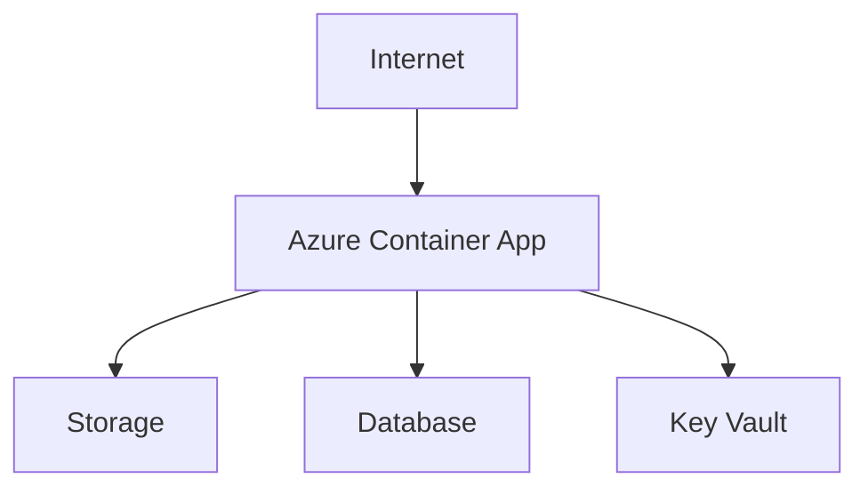
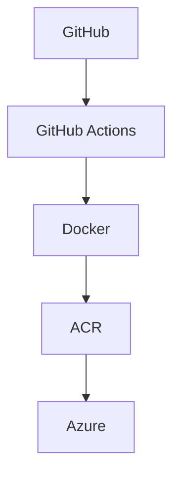

## English:

# GitHub Actions + Azure Lab

## Goal

Create a GitHub Actions workflow that runs on every push and performs:

1. Checkout of the code
2. Setup of the environment (Node.js)
3. Test
4. Docker build

The result can be checked in the **Actions** tab on GitHub.

## Architecture

### How a user reaches the application

### How the code reaches Azure

## Components

| Component | Purpose |
|---|---|
| Internet | Where users connect from |
| Azure Container App | Runs the application in a container |
| Storage | Stores files |
| Database | Stores data |
| Key Vault | Securely stores passwords and secrets |
| GitHub | Hosts the source code |
| GitHub Actions | Runs the workflow on every push |
| Docker | Builds the application image |
| ACR | Azure Container Registry, where Docker images are stored |
| Azure | Runs the image pulled

## ITALIANO:

# Laboratorio GitHub Actions + Azure

## Obiettivo

Creare un workflow GitHub Actions che, a ogni push, esegue:

1. Checkout del codice
2. Setup dell'ambiente (Node.js)
3. Test
4. Docker build

Il risultato si verifica nella sezione **Actions** di GitHub.

## Architettura

### Come l'utente usa l'applicazione

### Come il codice arriva su Azure

## Componenti

| Componente | A cosa serve |
|---|---|
| Internet | Da qui arrivano gli utenti |
| Azure Container App | Esegue l'applicazione in un container |
| Storage | Conserva i file |
| Database | Conserva i dati |
| Key Vault | Conserva in modo sicuro password e segreti |
| GitHub | Contiene il codice |
| GitHub Actions | Esegue il workflow a ogni push |
| Docker | Costruisce l'immagine dell'applicazione |
| ACR | Registro in cui si salvano le immagini Docker |
| Azure | Esegue l'immagine presa da ACR |

## Struttura del progetto

| File | Funzione |
|---|---|
| `index.js` | Programma di esempio |
| `test.js` | Test di esempio |
| `package.json` | Definisce il comando `npm test` |
| `Dockerfile` | Istruzioni per costruire l'immagine |
| `.github/workflows/ci.yml` | Il workflow GitHub Actions |

## Workflow

Il file `.github/workflows/ci.yml` parte a ogni push ed esegue in ordine:

1. **Checkout**: scarica il codice sul computer di GitHub
2. **Setup**: installa Node.js 20
3. **Test**: esegue `npm test`
4. **Docker build**: costruisce l'immagine con il Dockerfile

## Come verificare il risultato

1. Aprire il repository su GitHub
2. Cliccare la scheda **Actions**
3. Aprire l'ultima esecuzione e cliccare su **build**
4. Controllare che i 4 step abbiano la spunta verde
